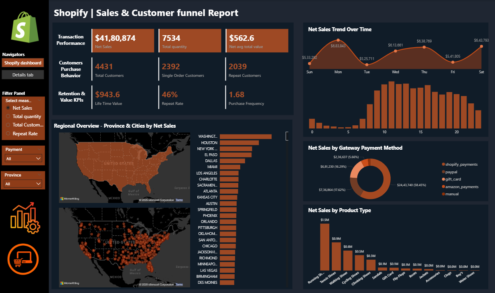

# Shopify-dashboard
## Project Objective:
 The objective of this project is to create a user-friendly Power BI dashboard that transforms complex Shopify sales transactions into clear, actionable visualizations, enabling users to:
 
-Monitor sales trends over various periods.

-Identify geographical sales distribution.

-Understand product performance and customer purchasing patterns.

-Optimize marketing and sales strategies based on data-driven insights.

## Dataset Used:
- <a href="https://github.com/Anjali29kri/Shopify-dashboard/blob/main/Shopify%20Sales.xlsx">Dataset</a>
## Dataset Terminology:
- <a href="https://github.com/Anjali29kri/Shopify-dashboard/blob/main/Shopify%20-%20Data%20Terminology.docx">Dataterminology</a>
## Tech Stack:
 The dashboard was built using the following tools and technologies:
 
• 📊 Power BI Desktop – Main data visualization platform used for report creation.

• 📂 Power Query – Data transformation and cleaning layer for reshaping and preparing the data.

• 🧠 DAX (Data Analysis Expressions) – Used for calculated measures, dynamic visuals, and conditional logic.

• 📝 Data Modeling – Relationships established among tables to enable cross-filtering and aggregation.
## Walkthrough: Key Visuals

1. Key Performance Indicators (KPIs):

   -Total Sales: Displays the overall revenue generated.

   -Total Customers: Shows the total count of unique customers.

   -Total Quantity: Indicates the total number of products sold.

   -Repeat Rate: Highlights the percentage of returning customers, a key metric for customer loyalty.

2. Product Performance by Type: A bar chart illustrating the contribution of different product categories to overall performance. This allows for quick identification of top-performing product types (e.g., Running Shoes, Tennis Shoes).

3. Geographical Performance: A visual (a filled map chart) that breaks down overall performance geographically by city, helping pinpoint strong and weak markets.

4. Payment Method Distribution: A chart (donut chart) showing the distribution of overall transactions across various payment gateways, revealing popular payment methods.
5. Trend Over Time: An area chart that shows the weekly trend a bar chart showing the trend hourly over time.
## Dasboard:

